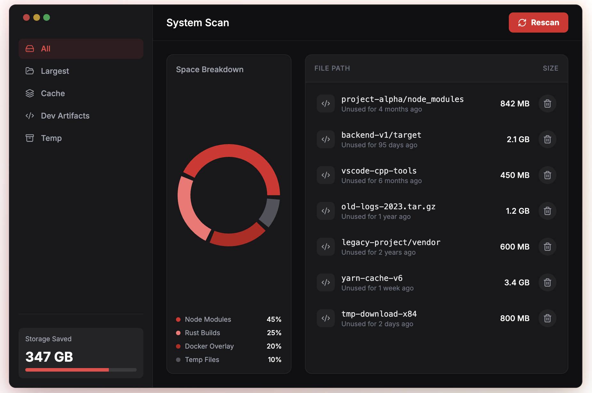

# Sweeper

A fast, cross-platform disk cleanup utility built with Zig and raylib.



## Features

- **Smart Detection**: Automatically finds dev artifacts (node_modules, target/, build/), caches, and temporary files
- **Confidence Scores**: Each item shows a safety rating (70-98%) based on category and age
- **Stale Detection**: Projects not modified in 90+ days are highlighted for safe cleanup
- **Safe Cleanup**: Preview everything before deletion - moves to trash by default for easy undo
- **Undo Support**: Press `Z` to restore the last deleted item from trash
- **Cross-Platform**: Native support for macOS, Linux, and Windows
- **Beautiful UI**: Modern dark theme with donut charts and intuitive navigation
- **Fast Scanning**: Uses optimized system commands (`find`/PowerShell) for rapid discovery
- **Comprehensive Coverage**: Scans package manager caches, IDE extensions, browser data, and more

## What Sweeper Finds

| Category | Examples |
|----------|----------|
| **Dev Artifacts** | `node_modules/`, `target/` (Rust), `.build/` (Swift), `Pods/`, `DerivedData/` |
| **Package Caches** | npm, yarn, pnpm, cargo, gradle, maven, pip, gem, composer |
| **IDE Extensions** | VS Code, Cursor, Windsurf, Zed, JetBrains |
| **Browser Data** | Chrome, Safari, Firefox, Edge, Brave caches |
| **System Caches** | Library/Caches, .cache, temp files, logs |

## Installation

### Build from Source

Requires [Zig 0.15+](https://ziglang.org/download/)

```bash
# Clone the repository
git clone https://github.com/augani/sweeper.git
cd sweeper

# Build GUI version
zig build

# Run
./zig-out/bin/sweeper-gui
```

### Pre-built Binaries

Download from the [Releases](https://github.com/augani/sweeper/releases) page.

| Platform | Download |
|----------|----------|
| macOS (Apple Silicon) | `sweeper-macos-arm64.tar.gz` |
| Linux (x64) | `sweeper-linux-x64.tar.gz` |
| Windows (x64) | `sweeper-windows-x64.zip` |

#### macOS: First-time Launch

macOS may block the app because it's not from the App Store. To run Sweeper:

**Option 1: Right-click to Open**
1. Right-click (or Control-click) on `sweeper-gui`
2. Select "Open" from the menu
3. Click "Open" in the dialog

**Option 2: Remove quarantine attribute**
```bash
# After extracting, run:
xattr -cr sweeper-macos-arm64/
```

**Option 3: System Settings**
1. Go to System Settings > Privacy & Security
2. Scroll down to find "sweeper-gui was blocked"
3. Click "Open Anyway"

## Usage

### GUI Mode (Recommended)

```bash
./sweeper-gui
```

1. Click **Rescan** to scan your system
2. Use sidebar filters (All, Largest, Cache, Dev Artifacts, Temp)
3. Select items to delete using checkboxes
4. Click **Delete** to remove selected items

### CLI Mode

```bash
./sweeper [options]
```

## Keyboard Shortcuts

| Key | Action |
|-----|--------|
| `R` | Rescan |
| `A` | Select All / Deselect All |
| `D` | Delete Selected |
| `Z` | Undo Last Deletion |
| `Enter` | Confirm Delete (in dialog) |
| `Esc` | Cancel/Close Dialog |
| `Q` | Quit |

## Configuration

Sweeper uses sensible defaults but can be configured:

- **Stale threshold**: Projects not modified in 90+ days are flagged
- **Scan depth**: Up to 12 levels deep to find nested dependencies
- **Result limit**: First 200 items for fast initial scan

## Safety

Sweeper is designed with safety in mind:

- **Preview First**: All items shown before deletion with size and category
- **No System Files**: Never touches OS-critical directories
- **Confidence Scores**: Each item shows 70-98% safety rating based on:
  - Category (caches/temp = 95%+, dev artifacts = 70-90%)
  - Age (stale projects 90+ days = higher confidence)
- **Trash by Default**: Moves to system trash instead of permanent deletion
- **Undo Support**: Press `Z` to restore last deleted item

## Building for Release

```bash
# Build optimized release
zig build -Doptimize=ReleaseFast

# Cross-compile for Windows
zig build -Dtarget=x86_64-windows-gnu -Doptimize=ReleaseFast

# Cross-compile for Linux
zig build -Dtarget=x86_64-linux-gnu -Doptimize=ReleaseFast
```

## Contributing

See [CONTRIBUTING.md](CONTRIBUTING.md) for guidelines.

## License

MIT License - see [LICENSE](LICENSE) for details.

## Acknowledgments

- Built with [Zig](https://ziglang.org/)
- GUI powered by [raylib](https://www.raylib.com/)
- Font: [Inter](https://rsms.me/inter/)
